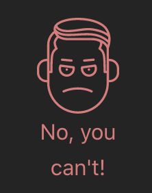
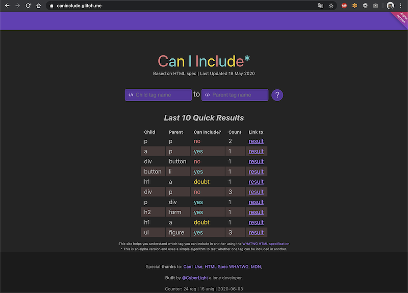

# CAN I INCLUDE

    

This project provides functionality to test whether one tag can be included in another. Based on information from [HTML Spec WHATWG](https://html.spec.whatwg.org/)

    
    
    

Please, see **Demo** [here](https://caninclude.glitch.me)

    

## Development environment
* [VSCode](https://code.visualstudio.com/)
* [VSCode Remote Containers](https://code.visualstudio.com/docs/remote/containers#_installation)
* Clone `git clone https://github.com/CyberLight/caninclude`
* Go to cloned project repo folder `cd caninclude`
* Open in VSCode `code .`
* In popup menu click by `Reopen in Container`
* Whew!

## Setup spec.json for app
* `npm run crawl` - this command crawl html spec page and make json data for app

## How to run app in development
* `npm run dev` - this open app using **nodemon**
* Go to url `http://localhost:3000` in your browser
* That's all!

### How to run app in production
* Need to set env variables from [Environment variables](#environment-variables)  section
* `npm start` - this command launch an app using **pm2** using **ecosystem.config.js**

## Environment variables
* `COOKIE_KEY` - a key for sign cookies `type: String`
* `FEEDBACK_DAILY_LIMIT` - a limit count of feedbacks daily `type: Integer`

## Project structure
* **.data** - a folder for sqlite database
* **.devcontainer** - a folder with VSCode Remote Containers configuration
* **components** - a folder with server components that was written in **Preact**.
* **scripts** - a folder with helper scripts for a project
* **crawl.js** - a script for crawling html spec page
* **ecosystem.config.js** - a configuration file for **pm2**
* **nodemon.json** - a configuration file for **nodemon**
* **server.js** - main and huge file which contains all routes and logic for an app
* **specfix.js** - a script for making some additional json data transformations
* **utils.js** - file with helper data managers and helper functions

## Project routes that are important
* `/` - Main page with some counters by usage of app and results for each tags
* `/can/include?parent=&child=` - renders page with full information and result of ability to include one tag into another
* `/admin/feedbacks` - ui for manage and view feedbacks 
    * For ability to access to this route, you need:
        * `npm run gen:invite role=admin`
        * This script will output url like this: `/invites/81493f1f9a306f64417b91960f6ded3b/apply`
        * Go to your browser and concatenate `http://localhost:3000` and `/invites/81493f1f9a306f64417b91960f6ded3b/apply` and press `Enter`
        * After that you can access to `/admin/feedbacks`

## License
See the [LICENSE](LICENSE.md) file for license rights and limitations (MIT).